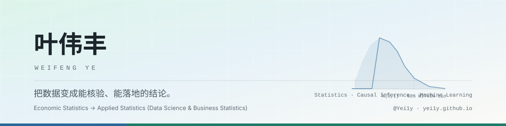
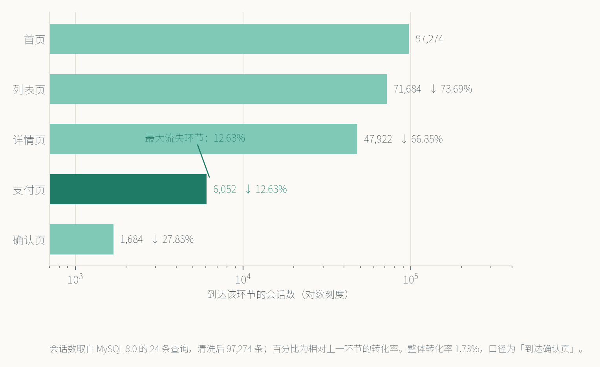
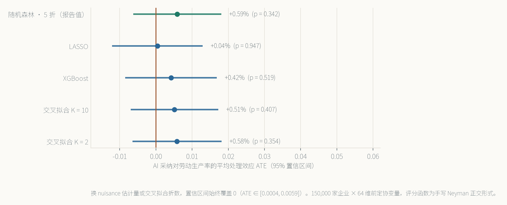

<picture>
  <source media="(prefers-color-scheme: dark)" srcset="assets/banner-dark.svg">
  
</picture>

经济统计学本科在读（暨南大学经济学院），推免至 **上海财经大学应用统计学**（数据科学与商务统计方向）。

| 加权平均绩点 | 专业排名 | 公开可复现仓库 | 论文 |
| :---: | :---: | :---: | :---: |
| **4.18 / 5.0** | **5 / 85**（前 6%） | **7** 个 | SCI 在投 **1** 篇（审稿返修中） |

> 判断标准只有一条：**结论要能被核验**。脚本编号化、随机种子固定、每一步结果落盘成表，README 里主动写明局限——包括对结论不利的那些。

**作品集（含三维评分表、按岗位裁剪建议）：<https://yei1y.github.io>**

---

## 精选项目

按「含金量 40% + 完成度 30% + 岗位匹配度 30%」加权排序；每一项数字都能在对应仓库的结果文件里查到。

| # | 项目 | 角色 / 性质 | 关键结果 | 仓库 |
| :-: | --- | --- | --- | --- |
| 1 | **企业破产预警「白盒」模型** | 第一完成人 · 全国大学生统计建模大赛广东省三等奖 | 94 项财务指标经杜邦模块样条展开与张量积交叉，显式构造 **31,616 维**交互空间 → 5,218 个候选 → **16 个**非零特征（15 个交互项）；测试集 **AUC 0.9380**、KS 0.7638，91 特征 LightGBM 基线 0.9404（差 0.0024）；漏报 / 误杀成本比 30.5 : 1 下净利润 3,510 / 8,944 万元 | [GitHub](https://github.com/Yei1y/Company-Bankruptcy-Prediction) |
| 2 | **广深两地家用智能健康设备市场调查** | 核心成员（数据模块）· 市场调查与分析大赛省级一等奖 + 省级大创 | 企业委托、全部数据自采：广深 2 城 21 街道 **747 + 444** 份有效问卷、841 + 476 分钟访谈、4,000 条电商评论；加权 K-Means 三类人群 13.19% / 56.35% / 30.46%；SEM 解释方差 **68.7%**（RMSEA 0.030，α = 0.983） | 委托项目，底稿涉密 |
| 3 | **GCor-SIS：超高维生存数据的稳健特征筛选** `论文项目` | 第二作者（第一作者：导师姜云卢教授）· SCI 期刊 *Communications in Statistics – Simulation and Computation* 审稿返修中 · 2026-05 于中国人民大学第二届全国高校本科生统计论坛作报告 | 基于格罗滕迪克相关的**无模型**筛选 + 数据拆分反射控制 FDR ≤ α + o(1)；强筛选一致性的证明**无需次指数尾部条件**；NKI295 乳腺癌数据 **C-index 0.7603**（对比方法中最高），识别出 QSOX2、NUSAP1 等已验证预后基因 | 论文审稿中，代码暂不公开 |
| 4 | **北京住房价格：特征价格模型与多元回归实证** | 独立完成 · 现代回归分析课程论文 | **318,160 条**链家成交记录、64 个特征；半对数 + 时间×区域双向固定效应；近地铁溢价被朴素对比高估约 **4.8 倍**（27.6% → 5.8%）；R² 0.8185，更精确的多项式模型因条件数 1.11 × 10¹² 被否 | [GitHub](https://github.com/Yei1y/beijing-housing-regression) |
| 5 | **AI 采纳与生产率：双重机器学习因果推断** | 独立完成 · 自主研究工作论文（含完整 LaTeX 论文与可复现代码） | **15 万家企业** × 43 字段 → 64 维前定协变量；手写 Neyman 正交评分 + 5 折交叉拟合，不调用高层 API；ATE = **+0.6%（p = 0.342，不显著）**，LASSO / RF / XGBoost 三法一致；因果森林显示 CATE 标准差 0.044（≈ ATE 的 8 倍） | [GitHub](https://github.com/Yei1y/ai-adoption-productivity-dml) |
| 6 | **电商用户行为漏斗分析与转化建模** `电商项目` | 独立完成 · 公开项目的批判式复现与深挖 | MySQL 8.0 显式 DDL + **24 条查询**（窗口函数算占比）；定位「详情页 → 支付页」段转化率仅 **12.63%**（流失 41,870 次）；卡方 + **BH 校正** + Cramér's V 判定 8 个维度中仅活跃度有实质关联（V = 0.2657） | [GitHub](https://github.com/Yei1y/user-behavior-funnel-analysis) |

另有 2 个项目（中文新闻分类 LSTM vs 朴素贝叶斯、影评情感分析四模型对比）侧重实验对照与数据质量核查——两者都识别出了原本看起来成立的结论里的隐患。见[项目全集](https://yei1y.github.io/projects/)。

---

## 两张图

**图 1 · 电商漏斗：10 万条会话里唯一该优先动的环节**
`详情页 → 支付页` 段转化率只有 12.63%，流失 41,870 次，约为第二大流失点的 10 倍；前两段仍维持在 67%–74%。

**图 2 · 因果推断：换掉 nuisance 估计量与交叉拟合折数，结论仍是零**
五种设定的 95% 置信区间全部覆盖 0（ATE ∈ [0.0004, 0.0059]）。这个项目交付的不是一个效应估计，而是一个**可辩护的零**——把「没有效应」写成结论，和把效应写显著需要同等证据。

两张图都由 [tools/make_figures.py](tools/make_figures.py) 从仓库结果文件生成，不手抄数值。

---

## 按岗位看同一批项目

同一批工作，投不同岗位时我会换一套讲法与顺序：

| 目标岗位 | 先讲哪个 | 讲什么 | 哪些压成一行 |
| --- | --- | --- | --- |
| **数据分析 / 商业分析** | 市场调查 → 电商漏斗 → 破产预警 | 「业务问题 → 口径 → 结论 → 建议」的闭环，SQL 取数与漏斗归因 | GCor-SIS 只作为方法学背书 |
| **数据科学 / 算法工程** | 破产预警 → GCor-SIS → DML | 高维、稀疏、类别不平衡、可复现；Rcpp 并行与内存控制 | 市场调查只说明业务侧也能承接 |
| **AI 产品运营 / 增长** | 市场调查 → 电商漏斗 | 用户洞察到可执行策略的完整链条 | 方法论细节全部淡化 |
| **研究岗 / 升学申请** | GCor-SIS → DML → 破产预警 | 引理证明、蒙特卡洛设计、从零实现估计量 | 课程论文只列题目 |

---

## 技术栈与项目印证

每一项都指到具体仓库与文件，并按实际用到的深度分级。

### 语言与工具

| 技术 | 用在哪个项目 | 实际用到的深度 | 代码 |
| --- | --- | --- | --- |
| **R** | GCor-SIS 论文；破产预警；市场调查作图 | 从零实现筛选算法；写 Rcpp C++ 扩展（`cppFunction` / `NumericMatrix`）；`makeCluster(20)` + `foreach %dopar%` 跑 20 次数据拆分反射 | [GCor_SIS_REDS_MDS.R](https://github.com/Yei1y/Company-Bankruptcy-Prediction/blob/main/scripts/GCor_SIS_REDS_MDS.R) |
| **Python** | 房产回归、DML、电商漏斗、THUCNews、影评 | pandas / numpy 数据管线 → statsmodels 计量诊断 → scikit-learn / PyTorch 建模，均为完整脚本而非 notebook 片段 | [scripts/](https://github.com/Yei1y/beijing-housing-regression/tree/main/scripts) |
| **SQL / MySQL 8.0** | 电商漏斗 | 显式 DDL 建表；24 条查询，含窗口函数算各环节占比；全国计算机二级（MySQL） | [code/](https://github.com/Yei1y/user-behavior-funnel-analysis/tree/main/code) |
| **SPSS / AMOS** | 市场调查 | 问卷信效度全套（Cronbach's α = 0.983、KMO = 0.977、Bartlett）+ SEM 建模（RMSEA 0.030）+ 简单斜率图 | 委托项目，底稿涉密 |
| **LaTeX** | DML、房产回归、THUCNews | 中文论文排版（XeLaTeX + ctexart）、公式推导、三线表、代码附录 | — |
| **Git** | 全部项目 | 五个仓库带 `requirements.txt`，脚本编号化且自包含，结果落盘后可复跑 | — |

### 方法与它解决的问题

| 方法 | 项目 | 用来解决什么 |
| --- | --- | --- |
| **高维特征筛选**（SIS、GCor-SIS、REDS） | 破产预警、GCor-SIS 论文 | 31,616 维交互空间中把候选压到 5,218，再压到 16；论文侧给出 FDR ≤ α + o(1) 的理论保证 |
| **惩罚回归**（SCAD、LASSO） | 破产预警、房产回归 | 前者做代价敏感稀疏选择（16 个非零特征），后者做变量筛选对照 |
| **样条展开 × 张量积** | 破产预警 | 把 94 个财务指标显式展开成交互空间，让非线性与模块间交互可被逐条解释 |
| **生存分析 / 无模型筛选** | GCor-SIS 论文 | 重尾（Cauchy、t(3)）与截尾（30% / 50%）下 Pearson 相关失效的问题；NKI295 上 C-index 0.7603 |
| **双重机器学习 / 因果森林** | DML | 控制 64 维协变量后估计 ATE，并刻画 CATE 异质性；安慰剂与敏感性分析 |
| **多重比较校正 + 效应量**（BH、Cramér's V） | 电商漏斗 | 8 个维度卡方检验全部显著，校正后只有活跃度具备实质关联——避免把大样本的显著性当成业务结论 |
| **抽样设计**（PPS 不等概率） | 市场调查 | 广深 2 城 21 街道的样本分配与加权 |
| **加权聚类 + SEM** | 市场调查 | 9 个变量加权后划出三类人群（13.19% / 56.35% / 30.46%），SEM 解释方差 68.7% |
| **回归诊断 / 决策理论** | 房产回归、破产预警 | 条件数与 VIF 诊断（多项式模型条件数 1.11 × 10¹² 被否）；把贝叶斯决策翻译成 30.5 : 1 成本比下的净利润 |
| **深度模型 × 传统基线对照** | THUCNews、影评 | 修正基线分词后差距从 59 pp 缩到 2.10 pp；四模型 5 折交叉验证暴露出训练 / 验证 0.96 vs 0.63 的过拟合 |

**一处自查**：破产预警的 MDS 筛选脚本里 `sample()` 没有前置 `set.seed()`，所以那一步的 20 次数据拆分不可复现——这一点写在仓库 README 的已知限制里。我选择写出它，而不是在技术栈里含糊带过。

**诚实标注的空白**：尚无实习经历；Docker / 服务部署、API 与 RAG / Agent 工作流、A/B 实验设计、SQL 留存与漏斗自连接取数尚未实操——这些都不在上面两张表里，正在补。

---

## 数字怎么核验

每个数都能顺着这条路径查回去，不必相信我：

| 数字 | 去哪查 |
| --- | --- |
| 六维评分与排序 | [项目全集](https://yei1y.github.io/projects/) 的三线表，评分口径写在表注 |
| 破产预警 AUC 0.9380 | `Company-Bankruptcy-Prediction/results/tables/model_metrics_scad.csv`，或由 `test_probabilities.csv` 重算 |
| 净利润 3,510 / 8,944 万元 | `Company-Bankruptcy-Prediction/results/tables/economic_scenarios.csv` |
| 16 个非零特征 | `Company-Bankruptcy-Prediction/results/tables/scad_selected_features.csv` |
| 电商漏斗 12.63% | `user-behavior-funnel-analysis` 的 SQL 输出表与 `results.md` |
| DML 的 ATE 与稳健性 | `ai-adoption-productivity-dml/output/tables/dml_results.csv` 与 `robustness_results.csv` |
| 房产回归系数与诊断 | `beijing-housing-regression/output/tables/vif_results.csv`、`consensus_ols_coefficients.csv` |

---

## 荣誉（部分）

2025 **国家奖学金** · 第十六届全国大学生数学竞赛广东省**一等奖** · 全国大学生市场调查与分析大赛广东赛区**省级一等奖** · 全国大学生统计建模大赛广东省三等奖 · MathorCup 数学应用挑战赛国家级三等奖 · 全国计算机等级考试二级（MySQL，良好）· CET-6 551

---

## 联系

**邮箱** yeily_github@163.com &nbsp;·&nbsp; **作品集** <https://yei1y.github.io> &nbsp;·&nbsp; **现居** 广州（就学）

正在寻找 **数据科学 / 数据分析**方向的实习机会（AI 产品与增长相关岗位同样欢迎）：广州优先，深圳可接受。
